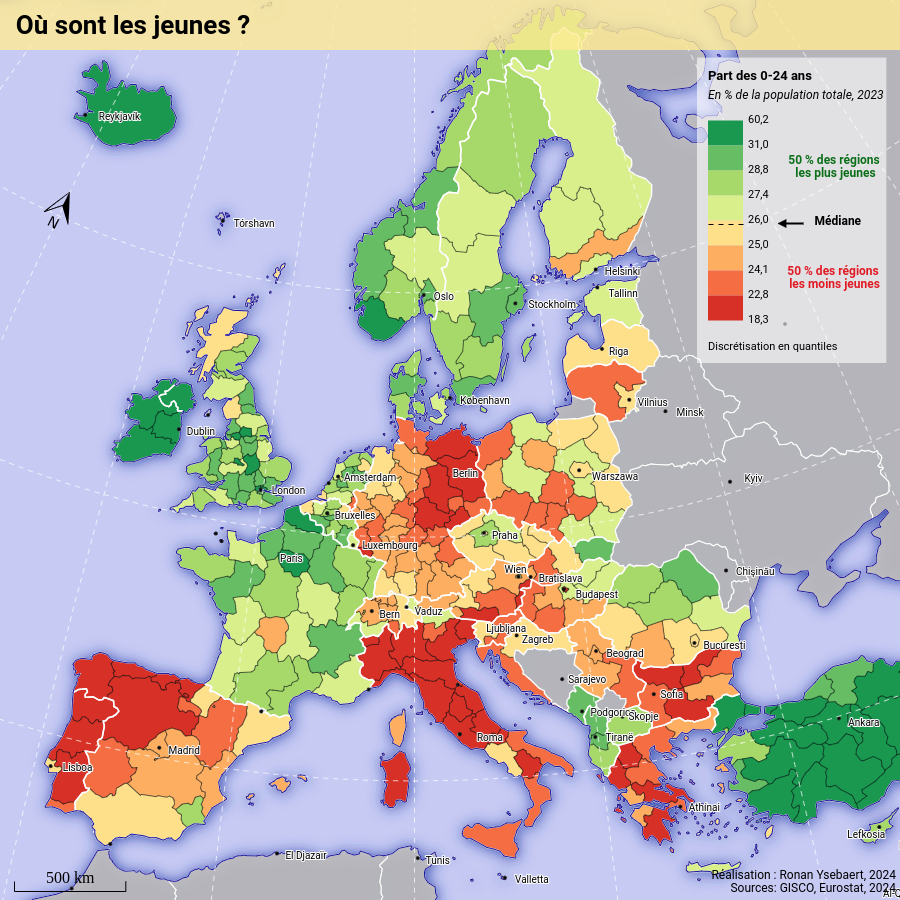
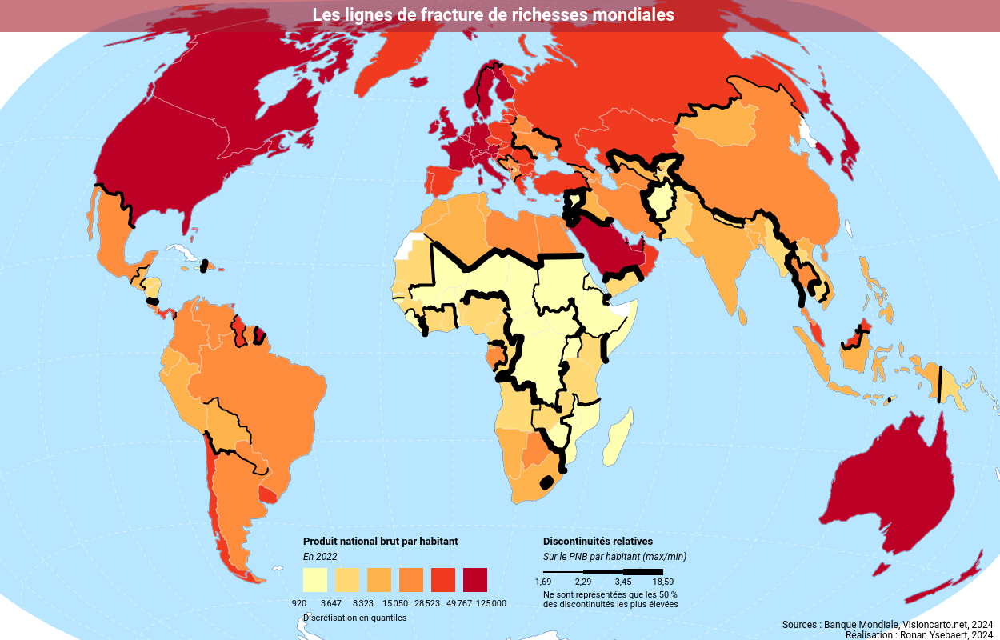

# Magrit - Thematic cartography

[en] [Magrit](https://magrit.cnrs.fr) is an online thematic mapping application developed by [UAR RIATE](https://riate.cnrs.fr/).  
[fr]  [Magrit](https://magrit.cnrs.fr) est une application de cartographie thématique développée par l'[UAR RIATE](https://riate.cnrs.fr/).


## Basics

- Magrit is a web application for thematic mapping (*cartography*).
- Everything happens in the browser, so **your data never leaves your computer**.
- It's intentionally simple (the UI follows the basic steps of map creation).
- It's **designed for teaching and learning cartography**.
- It lets you import **your own geometry dataset** (**Shapefile**, **GeoJSON**, **GML**, **GeoPackage**, etc.) and optionally your **tabular file** (CSV, XLS, XLSX, etc.).
- We also provide many sample datasets to try out the various representations and become familiar with the application.
- It allows to **render and combine a wide variety of maps**: choropleth, proportional symbols, cartogram, discontinuity, smoothed maps, links, etc.
- It supports all the most popular modern desktop browsers.
- Magrit is written in modern JS and uses notably [solid.js](https://github.com/solidjs/solid) and [d3.js](https://github.com/d3/d3) libraries
  as well as various WebAssembly modules ([GDAL](https://github.com/bugra9/gdal3.js), [GEOS](https://github.com/chrispahm/geos-wasm), [Contour-wasm](https://github.com/mthh/contour-wasm), [go-cart-wasm](https://github.com/riatelab/go-cart-wasm)).

## Try it out

- Online version: [https://magrit.cnrs.fr](https://magrit.cnrs.fr)
- [Download the desktop version](https://magrit.cnrs.fr/download/)

## Examples





## Development

Requirements:

- Node.js (>= 20) / NPM (>= 10).

### Installation

```bash
npm install
```

### Running for development

```bash
npm run dev
```

The application will be available at [http://localhost:3000](http://localhost:3000). 

### Running for development, with electron

```bash
npm run dev:electron
```

A window will open with the application running.

### Building for production

```bash
npm run build
```

The application and it's documentation will be built in the `dist` directory.

### Building for production, with electron

```bash
npm run build:electron
```

The application (for Windows and GNU/Linux) will be built in the `release` directory.

## License

GPL-3.0-or-later
